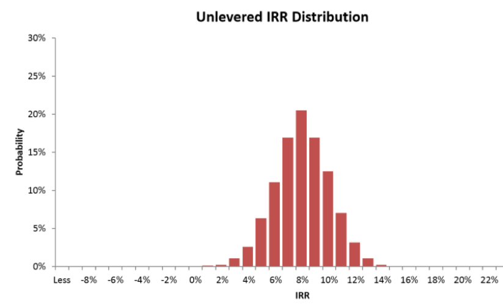
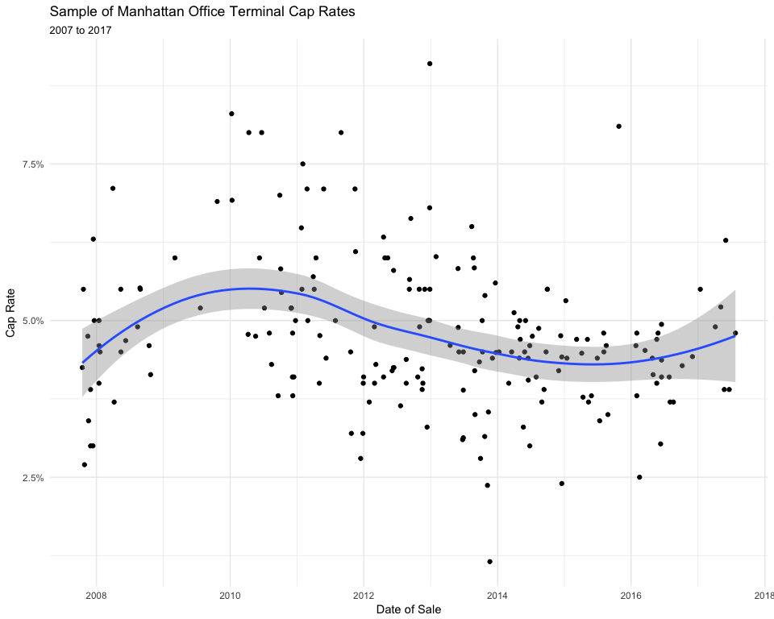
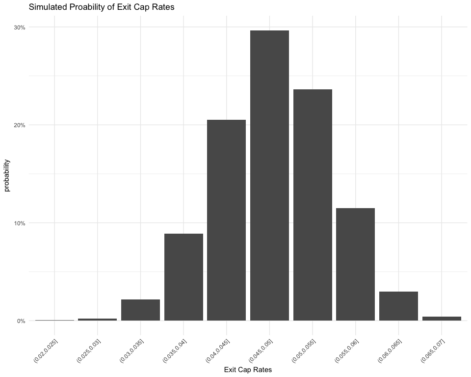
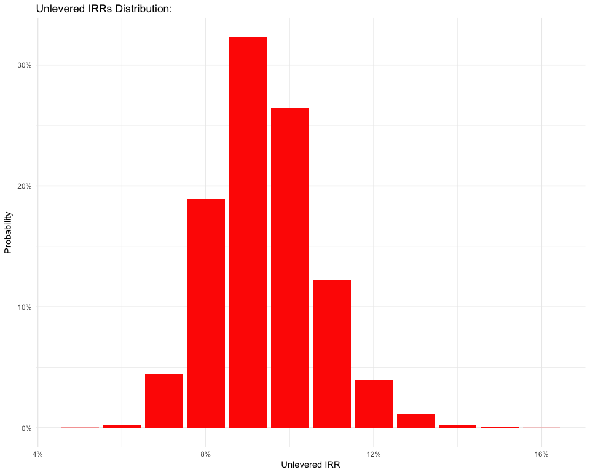

Commerical Real Estate Investment Risk Analysis using Monte Carlo Simulation
================

Your typical Commercial Real Estate underwriting model (Office, Retail, Residential, Industrial) will include numerous assumptions about the value of the asset and the future movements of the market. For example:

-   The exit cap at year 10 will be `4.5%`
-   The cost of sale will be `4.0%`
-   You annual management fees will amount to `3%` of GPI
-   Rent growth will be `4%` per year and vacancy will remain at `8%`
-   etc.

How these assumptions are produced is an alchemy of analysis, industry experience and "what looks right"-ness. Estimating assumptions is a difficult "art-more-than-science" endevour and can make or break an investment decision.

One way to enhance the investment decision making process is to introduce the concept of *quantified uncertainty* to the equation. Borrowing from statistics, we can replace point estimate assumptions with mean-value estimates and confidence intervals. An `8%` vacancy rate becomes a mean of `8%` with a standard-deviation of `0.12` and a `95% confidence interval` of `7.88%` to `8.24%`, for example.

What this allows us to do is generate ranges of probable outcomes for many assumptions. For example, this graph might represent a range of possible exit caps:


With ranges of potential assumption values, we can then simulate many potential future states based on combinations of assumption probabilities. This results in likelihood ranges for things like exit caps, sale price, IRR, ROI and more, for example:



We're also able to answer the all important question: How likely am I to lose money on this investment?

We are going to combine univariate forecasts of some top-level underwriting assumptions with Monte Carlo simulation to generate a range of probable IRR's for a hypothetical Manhattan Office investment.

``` r
library(tidyverse)
library(stringr)
library(forecast)
library(zoo)


set.seed(608)
```

User Inputs
===========

Let us define our hypothetical investment as an Office Building purchased for `$31.5M` in year T with the intent of selling the building at year T+10. The building currently generates `$1.2M` in operating income. We will also set our number of simulations to 10,000.

``` r
# a fictitious purchase price
purchase_price <- 31500000

# years to hold the property
year_hold <- 10

# current year NOI
current_NOI <- 1200000

# input the number simulations to run
n_sims <- 10000
```

Our hypothetical purchase cap rate is 3.81%.

Exit Caps
=========

We will be using a sample of cap rates pulled from [RCA](https://www.rcanalytics.com/) to create a forecast of potential exit caps at year 10.

``` r
# Exit Cap data from RCA
RCA_trxns <- read_csv("data/RCA_manhat_office_trxs.csv") %>% mutate(Date = as.Date(Date, format = "%m/%d/%y"))

manhat_office_caps <- 
  RCA_trxns %>% select(`Cap Rate`, Date) %>% filter(!is.na(`Cap Rate`)) %>% 
  mutate(Year = lubridate::year(Date)
         , Month = lubridate::month(Date)
         , YearMonth = as.Date(paste(Year,Month,"01",sep="-"), format = "%Y-%m-%d"))

head(manhat_office_caps)
```

    ## # A tibble: 6 x 5
    ##   `Cap Rate`       Date  Year Month  YearMonth
    ##        <dbl>     <date> <dbl> <dbl>     <date>
    ## 1 0.04800000 2017-07-24  2017     7 2017-07-01
    ## 2 0.03900000 2017-06-20  2017     6 2017-06-01
    ## 3 0.06280000 2017-06-01  2017     6 2017-06-01
    ## 4 0.03900000 2017-05-24  2017     5 2017-05-01
    ## 5 0.05217554 2017-05-05  2017     5 2017-05-01
    ## 6 0.04900000 2017-04-05  2017     4 2017-04-01

Forecasting exit cap rates out 10 years
---------------------------------------

Since we want to sell at year 10, we would normally need to forecast to year 11 (purchase prict would be based on T+10+1 cap rate). However to simplify things we will only forecast 10 year exit caps.

``` r
# calculate the mean and standard deviation of cap rates:
cap_rate_means <- 
  manhat_office_caps %>% 
  group_by(YearMonth) %>% 
  summarise(Mean_cap = mean(`Cap Rate`, na.rm = T)
           , SD_cap = sd(`Cap Rate`, na.rm = T)
           , count = n()
           ) %>% 
  mutate(SD_cap = zoo::na.locf(SD_cap, na.rm = T))

# visualize exit cap rates and standard deviations over time (Office, Manhattan)
cap_rate_means %>% 
  mutate(upper_sd = Mean_cap+SD_cap, lower_sd = Mean_cap - SD_cap) %>% 
  ggplot()+
  aes(x = YearMonth, y = Mean_cap)+
  geom_ribbon(aes(ymin = lower_sd, ymax = upper_sd), alpha = 0.3, fill = "skyblue")+
  geom_line(size = 1, color = "black")+
  theme_minimal()+
  scale_y_continuous(labels = scales::percent)+
  labs(title = "Average Office Cap Rates with Standard Deviations")
```


Next we apply a basic univariate forecasting technique. It's important to note that forecasting requires much more care than this, and predictive models can be built and validated in any number of ways. For a great resource on forecasting, see [Rob J Hyndman's Forecasting: principles and practice](https://www.otexts.org/fpp).

For our purposes, we apply a simple ARIMA model with some smoothing and then move on:

``` r
# forecasting exit cap rates 10 years
ts(cap_rate_means$Mean_cap
     , start = c(2007,7)
     , end = c(2017,7)
     , frequency = 12) %>% 
  assign("cap_rate_means_ts",value = ., pos = 1) %>% 
  smooth() %>% 
  auto.arima() %>% 
  assign("mod",value = ., pos = 1) %>% 
  forecast(h = 12*year_hold) %>% 
  plot(main = "Forecasting Exit Cap Rates")
```



``` r
# extract the point forecasts into a dataframe
# 95% CI is 2 standard deviations, so, 95% CI/2  = one SD

cap_for <- forecast(cap_rate_means_ts, model = mod, h = 12*year_hold)

date_seq <- seq.Date(from = as.Date("08-2017-01", format = "%m-%Y-%d")
                     , to = as.Date("07-2027-01", format = "%m-%Y-%d")
                     , by= "month")

cap_forc_data <- 
  tibble("YearMonth" = date_seq
         , "Mean_cap" = as.numeric(cap_for$mean)
         , "SD_cap" = as.numeric(cap_for$upper[,2]-as.numeric(cap_for$mean))/2
         ) %>% 
  mutate("Lower_bound" = Mean_cap - SD_cap, "Upper_bound" = Mean_cap + SD_cap) 

head(cap_forc_data)
```

    ## # A tibble: 6 x 5
    ##    YearMonth   Mean_cap      SD_cap Lower_bound Upper_bound
    ##       <date>      <dbl>       <dbl>       <dbl>       <dbl>
    ## 1 2017-08-01 0.03749130 0.002660859  0.03483044  0.04015216
    ## 2 2017-09-01 0.02656311 0.004062938  0.02250018  0.03062605
    ## 3 2017-10-01 0.04146226 0.004967076  0.03649518  0.04642933
    ## 4 2017-11-01 0.03193785 0.005418551  0.02651930  0.03735640
    ## 5 2017-12-01 0.04414101 0.005793698  0.03834731  0.04993471
    ## 6 2018-01-01 0.03589676 0.005990919  0.02990584  0.04188768

Forecasting Rent Growth
=======================

We want to know what the terminal year NOI will be. Again, over-simplifying things quite a bit, we will use forecasted rent growth as a proxy for NOI growth.

The base office rent data is taken from [CoStar](http://www.costar.com/).

``` r
# Office rent data from CoStar
costar_manhat_office <- read_csv("data/Costar_office_manhat_stats.csv")

office_rents <- 
  costar_manhat_office %>% 
  filter(Quarter!="QTD") %>% 
  mutate(Year = str_replace(Quarter," Q[0-9]","")
         , Quart = str_extract(Quarter,"Q[0-9]")
         , YearQuarter = lubridate::yq(paste(Year,Quart))
         ) %>% 
  select(YearQuarter,`Office Gross Rent Overall`) %>% 
  arrange(YearQuarter) %>% 
  mutate(QoQ = (`Office Gross Rent Overall`-lag(`Office Gross Rent Overall`,1))/lag(`Office Gross Rent Overall`,1)) %>% 
  mutate(QoQ = if_else(is.na(QoQ),0,QoQ)) %>% 
  mutate(Cumlative_RG = cumsum(QoQ))

head(office_rents)
```

    ## # A tibble: 6 x 4
    ##   YearQuarter `Office Gross Rent Overall`          QoQ Cumlative_RG
    ##        <date>                       <dbl>        <dbl>        <dbl>
    ## 1  1996-07-01                       27.67  0.000000000   0.00000000
    ## 2  1996-10-01                       26.87 -0.028912179  -0.02891218
    ## 3  1997-01-01                       27.96  0.040565687   0.01165351
    ## 4  1997-04-01                       28.16  0.007153076   0.01880658
    ## 5  1997-07-01                       28.40  0.008522727   0.02732931
    ## 6  1997-10-01                       29.86  0.051408451   0.07873776

Visualizig office rent growth
-----------------------------

``` r
office_rents %>% 
  ggplot()+
  aes(x = YearQuarter, y = QoQ)+
  geom_col()+
  geom_line(aes(y = Cumlative_RG))+
  theme_minimal()+
  scale_y_continuous(labels = scales::percent)+
  labs(title = "Manhattan Office Quarterly Rent Growth"
       , y = NULL
       , x = NULL)
```


Forecasting cumulative rent growth over 10 years
------------------------------------------------

We apply another univariate forecast to the rent growth rate in order to produce a cumulative 10-year rent growth rate forecast.

``` r
ts(office_rents$Cumlative_RG, start = c(1996,3), end = c(2017,2), frequency = 4) %>% 
  stl(s.window="periodic", t.window = 4, l.window = 10) %>% 
  forecast(method="naive", h = 4*year_hold) %>% 
  assign("fcast", value = ., pos = 1) %>% 
  plot(main = "Forecasting cumulative rent growth")
```


``` r
# extract the point forecasts into a datafram
# 95% CI is 2 standard deviations, so, 95% CI/2  = one SD
date_seq2 <- seq.Date(from = as.Date("07-2017-01", format = "%m-%Y-%d")
                      , to = as.Date("04-2027-01", format = "%m-%Y-%d")
                      , by= "quarter")
rent_forc_data <- 
  tibble("YearMonth" = date_seq2
         , "Mean_rent" = as.numeric(fcast$mean)
         , "SD_rent" = (fcast$upper[,2]-fcast$mean)/2
         ) %>% 
  mutate("Lower_bound" = Mean_rent - SD_rent, "Upper_bound" = Mean_rent + SD_rent) 


# adjust rent growth data so that it is growth relative to today
# we're also aritficially inflating the rent growth data, to make the example more interesting
set.seed(2017)
rent_forc_data <- 
  rent_forc_data %>% 
  mutate(rent_adj = rnorm(n = nrow(rent_forc_data), mean = 0.8, sd = 0.3)) %>% 
  mutate(Mean_rent = Mean_rent + rent_adj
         , SD_rent = SD_rent + rent_adj
         , Lower_bound = Lower_bound + rent_adj
         , Upper_bound = Upper_bound + rent_adj) %>% 
  mutate_at(vars(Mean_rent:Upper_bound), .funs = function(x) x - (office_rents$Cumlative_RG[which(office_rents$YearQuarter==max(office_rents$YearQuarter))])) 
```

Monte Carlo Simulations
=======================

Now that we have our forecasts (with confidence intervals), we run several thousand simulations reflecting the varying possible combinations of assumption values.

``` r
# isolate the exit year:
exit_year_data_cap <- cap_forc_data %>% filter(row_number()==year_hold*12) #monthly
exit_year_data_rents <- rent_forc_data %>% filter(row_number()==year_hold*4) #quarterly
```

Simulation of cap rates
-----------------------

Based on our forecasts, there is a 29% chance that the exit cap rate at year 10 will be between a `4.5%` and a `5%`.

``` r
exit_caps_sim <- abs(rnorm(n = n_sims, mean = exit_year_data_cap$Mean_cap, sd = exit_year_data_cap$SD_cap))

exit_caps_sim %>% 
  as_data_frame() %>% 
  mutate(buckets = cut(value,breaks = seq(0,max(.),by=0.005))) %>% 
  group_by(buckets) %>% 
  summarise(count = n()) %>% 
  filter(!is.na(buckets)) %>% 
  mutate(probability = count/sum(count)) %>% 
  ggplot()+
  aes(x = buckets, y = probability)+
  geom_col()+
  theme_minimal()+
  theme(axis.text.x = element_text(angle = 45, hjust = 1))+
  scale_y_continuous(labels = scales::percent)+
  labs(title = "Simulated Proability of Exit Cap Rates"
       , x = "Exit Cap Rates")
```


Simulation of rent growth:
--------------------------

We calculate an 18% chance that rent will grow between 72% and 74% in 10 years:

``` r
exit_year_rents_sim <- rnorm(n = n_sims, mean = exit_year_data_rents$Mean_rent, sd = abs(exit_year_data_rents$SD_rent))

exit_year_rents_sim %>% 
  as_data_frame() %>% 
  filter(is.finite(value)) %>% 
  mutate(buckets = cut(value
                       ,breaks = seq(from = 0, to = range(exit_year_rents_sim)[2],by=0.02)
                       )
         ) %>% 
  group_by(buckets) %>% 
  summarise(count = n()) %>% 
  filter(!is.na(buckets)) %>% 
  mutate(probability = count/sum(count)) %>% 
  ggplot()+
  aes(x = buckets, y = probability)+
  geom_col()+
  theme_minimal()+
  theme(axis.text.x = element_text(angle = 45, hjust = 1))+
  scale_y_continuous(labels = scales::percent)+
  labs(title = "Simulated Proability of Rent Growth"
       , x = "Rent Growth")
```


Simulation of NOI:
------------------

We use rent growth to calculate exit year NOI, which we find has a ~14% chance to be between `$2.075` and `$2.1` million dollars:

``` r
exit_year_noi_sim <- (exit_year_rents_sim*current_NOI)+current_NOI

exit_year_noi_sim  %>% 
  as_data_frame() %>% 
  mutate(buckets = cut(value,breaks = seq(0,max(.),by=25000)
                       , dig.lab = 6)
         ) %>% 
    group_by(buckets) %>% 
    summarise(count = n()) %>% 
    filter(!is.na(buckets)) %>% 
    mutate(probability = count/sum(count)) %>% 
    ggplot()+
    aes(x = buckets, y = probability)+
    geom_col()+
    theme_minimal()+
    theme(axis.text.x = element_text(angle = 45, hjust = 1))+
    scale_y_continuous(labels = scales::percent)+
    labs(title = "Simulated Proability of Exit Year NOI"
         , x = "NOI ($ Millions)")
```



Simulation of sales price
-------------------------

Finally, we combine exit-year cap rates with NOI to generate potential sale prices. There is a ~35% chance of selling between 40-45 million dollars:

``` r
sale_price_sim <- exit_year_noi_sim/exit_caps_sim

sale_price_sim %>% 
 as_data_frame() %>% 
  mutate(buckets = cut(value, breaks = seq(0,max(.),by=5000000))) %>% 
    group_by(buckets) %>% 
    summarise(count = n()) %>% 
    filter(!is.na(buckets)) %>% 
    mutate(probability = count/sum(count)) %>% 
    ggplot()+
    aes(x = buckets, y = probability)+
    geom_col()+
    theme_minimal()+
    theme(axis.text.x = element_text(angle = 45, hjust = 1))+
    scale_y_continuous(labels = scales::percent)+
    labs(title = "Simulated Proability of Exit Year Sales Price"
         , x = "Exit Sale Price")
```


ROI
===

A simple ROI calculation (with no discounts applied):

``` r
ROI <- round((sale_price_sim - purchase_price)/purchase_price,2)

ROI %>% 
  as_data_frame() %>% 
  mutate(buckets = round(value,1)) %>% 
  group_by(buckets) %>% 
  summarise(count = n()) %>% 
  filter(!is.na(buckets)) %>% 
  mutate(probability = count/sum(count)) %>% 
  ggplot()+
  aes(x = buckets, y = probability)+
  geom_col()+
  theme_minimal()+
  scale_x_continuous(breaks = seq(0,6,by=1), labels = scales::percent)+
  scale_y_continuous(labels = scales::percent)+
  labs(title = "Simulated Proability of Exit Year ROI"
       , x = "10 Year ROI")
```


Unlevered IRR
=============

Putting it all together, we can simulate theoretical cash flows over all of our simulations and calculate an IRR for each. The output is a distribution of possible IRR's for a given deal given starting NOI and purchase price over a ten year hold period.

This part is particularly cumbersome in terms of computation time. The formula for IRR involves searching through possible discount rates until the one that makes the NPV tend to zero is found, making a bottleneck of sorts.

``` r
# this function computes IRR

IRR <- function (cash_flow) {
  
  pv.simple <- function (r, n, fv) return((fv/(1 + r)^n) * (-1))
  
  pv.uneven <- function (r, cf) {
    n <- length(cf)
    sum <- 0
    for (i in 1:n) {
      sum <- sum + pv.simple(r, i, cf[i])
    }
    return(sum)
  }
  
  n <- length(cash_flow)
  subcf <- cash_flow[2:n]
  uniroot(function(r) -1 * pv.uneven(r, subcf) + cash_flow[1]
          , interval = c(1e-10, 1e+10)
          , extendInt = "yes")$root
}
```

Generate NOIs for year T to T+10

``` r
# condense rent forecasts to yearly:
rent_forc_data_yearly <-
  rent_forc_data %>% 
  mutate(Year = lubridate::year(YearMonth)) %>% 
  group_by(Year) %>% 
  summarise(Mean_rent = mean(Mean_rent, na.rm = T)
            ,SD_rent = mean(SD_rent, na.rm = T)
            ,Lower_bound = mean(Lower_bound, na.rm = T)
            ,Upper_bound = mean(Upper_bound, na.rm = T)
            ) %>% 
  filter(Year!=2027)

# starting year 0 with the purchase price:
NOI_Mat <- data_frame("Year_0" = rep(-1*purchase_price, times = n_sims))

# for every year for forecasted rent growth, calculate a probable NOI:
for(year in 1:nrow(rent_forc_data_yearly)){
    year_t <- rent_forc_data %>% filter(row_number()==year)
    year_t_cgr <- rnorm(n = n_sims, mean = year_t$Mean_rent, sd = abs(year_t$SD_rent))
    year_t_NOI <- data_frame(current_NOI + (current_NOI * year_t_cgr))
    names(year_t_NOI) <- paste0("Year_",year)
    NOI_Mat <- bind_cols(NOI_Mat,year_t_NOI)
}

# we'll assume that in year 10, we collect NOI as well as sell the property:
sale_price_sim <- exit_year_noi_sim/exit_caps_sim
NOI_Mat$Year_10 <- NOI_Mat$Year_10+sale_price_sim

head(NOI_Mat)
```

    ## # A tibble: 6 x 11
    ##      Year_0  Year_1  Year_2  Year_3  Year_4  Year_5  Year_6    Year_7
    ##       <dbl>   <dbl>   <dbl>   <dbl>   <dbl>   <dbl>   <dbl>     <dbl>
    ## 1 -31500000 2710200 2212145 2782856 1510110 2145488 2314575 2147745.7
    ## 2 -31500000 3461208 2034560 2185865 1718766 2161735 2166230  650915.0
    ## 3 -31500000 2403579 2115229 1898906 1117627 2198728 2292104  352541.3
    ## 4 -31500000 2480998 2003821 2699094 1729198 2056147 2364487  640361.3
    ## 5 -31500000 2213582 2007102 2695110  776585 2128837 2504483 1754267.5
    ## 6 -31500000 2137601 2142499 2558708 1762329 2119933 2232987 1787973.7
    ## # ... with 3 more variables: Year_8 <dbl>, Year_9 <dbl>, Year_10 <dbl>

Compute IRRs:
-------------

``` r
IRR_byrow <- function(row) IRR(as.numeric(row))

NOI_Mat$IRR <- apply(NOI_Mat, 1, IRR_byrow)

head(NOI_Mat)
```

    ## # A tibble: 6 x 12
    ##      Year_0  Year_1  Year_2  Year_3  Year_4  Year_5  Year_6    Year_7
    ##       <dbl>   <dbl>   <dbl>   <dbl>   <dbl>   <dbl>   <dbl>     <dbl>
    ## 1 -31500000 2710200 2212145 2782856 1510110 2145488 2314575 2147745.7
    ## 2 -31500000 3461208 2034560 2185865 1718766 2161735 2166230  650915.0
    ## 3 -31500000 2403579 2115229 1898906 1117627 2198728 2292104  352541.3
    ## 4 -31500000 2480998 2003821 2699094 1729198 2056147 2364487  640361.3
    ## 5 -31500000 2213582 2007102 2695110  776585 2128837 2504483 1754267.5
    ## 6 -31500000 2137601 2142499 2558708 1762329 2119933 2232987 1787973.7
    ## # ... with 4 more variables: Year_8 <dbl>, Year_9 <dbl>, Year_10 <dbl>,
    ## #   IRR <dbl>

``` r
NOI_Mat$IRR %>% summary()
```

    ##    Min. 1st Qu.  Median    Mean 3rd Qu.    Max. 
    ## 0.05391 0.08553 0.09314 0.09398 0.10146 0.16121

``` r
NOI_Mat %>% 
  mutate(bucket = round(IRR,2)) %>% 
  group_by(bucket) %>% 
  summarise(count = n()) %>% 
  mutate(Probability = count/sum(count)) %>% 
  ggplot()+
  aes(x = bucket, y = Probability)+
  geom_col(fill ="#FF2700")+
  scale_x_continuous(labels = scales::percent)+
  scale_y_continuous(labels = scales::percent)+
  theme_minimal()+
  labs(title = "Unlevered IRRs Distribution:"
       , x = "Unlevered IRR")
```


